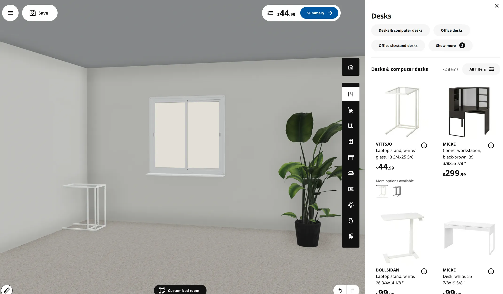

# Monis Rent - 3D Workspace Designer

[](https://nextjs.org/)
[](https://react.dev/)
[](https://threejs.org/)
[](https://zustand-demo.pmnd.rs/)

> Built for the **[Desent Coding Test #2](https://www.desent.io/coding-test-2)**.

Monis Rent provides premium office equipment to digital nomads and startups in Bali. This interactive tool replaces traditional, static catalogs with a fun, visual experience where users can design their dream workspace in real-time before renting.


*The clean, structural aesthetic of IKEA's UI served as our primary design foundation, emphasizing high-end professionalism and modularity.*

---

## 📝 Note on Submission & Timeline

I wanted to provide an update on the technical task. Due to some unexpected scheduling overlaps early this week, I wasn't able to give this project the focused deep-dive it required until today.

I’ve spent today architecting the solution using a Feature-Sliced Design to ensure scalability and optimizing the 3D asset pipeline, creating the assets, optimizing them (PBR to Draco-compressed GLB) to meet high-performance web standards.

I’m on track to submit the finished, production-ready build by Today. I appreciate your patience—I wanted to ensure the quality of the delivery reflected my actual standard of work rather than rushing a sub-optimal version.

---

### Technical High-Level

- **Feature-Sliced Design (FSD)**: Chosen for strict domain encapsulation, ensuring that 3D rendering logic (Workspace) never leaks into business pricing logic (Catalog).
- **Client Boundary Optimization**: We push `"use client"` deep into the tree. Purely visual sections are Server Components, while only the 3D Canvas and interactive buttons are hydrated as Client Components.
- **State Governance**: Zustand handles the complex relationships between selected items, rental periods (weekly vs. monthly), and real-time pricing derivations.

---

## Must-Haves Implementation

- [x] **Multiple Options**: At least 2 desk options and 2 chair options (Electrical, Mechanical, Simple).
- [x] **Accessories**: Fully functional accessory catalog (Monitors, Lamps, Plants, Webcams).
- [x] **Visual Updates**: Real-time 3D preview updates instantly as items are added/changed.
- [x] **Checkout Summary**: A detailed summary view calculating total price and savings.
- [x] **Deployment**: Ready for Vercel deployment.

---

## 🛠 Tech Stack

| Category | Technology | Rationale |
| :--- | :--- | :--- |
| **Core** | **Next.js 15** | Required. Provides exceptional image optimization and routing. |
| **Styling** | **Tailwind CSS 4** | Required. Modern, high-performance styling. |
| **3D Engine** | **Three.js + R3F** | The industry standard for high-performance React 3D experiences. |
| **State** | **Zustand** | Minimalist state management that bridges 2D UI and 3D Canvas seamlessly. |
| **Animations** | **Framer Motion** | Adds that "premium" feel with smooth state transitions. |

---

## 🏗 Modular Architecture (FSD)

```bash
src/features/
├── workspace/           # 3D Logic (Three.js, Canvas, Models)
│   ├── components/      # WebGL Viewport, Lighting, Scene Environment
│   ├── hooks/           # useWASDControls, useModelLoading
│   └── types/           # GLB Schema & Camera Vectors
├── catalog/             # Product Logic (Data, Filters, Selection)
│   ├── components/      # Responsive Sidebar, Summary Panel
│   ├── store/           # Zustand: Selection logic & Price Derivation
│   └── types/           # Product definitions
└── checkout/            # Transaction Logic
    └── components/      # Final Order Summary & Submission
```

---

## ✨ Code Highlights

### Reactive Pricing Matrix

Instead of using complex `useEffect` chains, we use a centralized `computeDerived` helper within the Zustand store. This ensures the pricing, item count, and savings are always in sync with the current selection.

```typescript
// src/features/catalog/store/useCatalogStore.ts
function computeDerived(selectedDesk, selectedChair, accessories, rentalPeriod) {
    const allItems = [...(selectedDesk ? [selectedDesk] : []), ...];
    const total = allItems.reduce((sum, item) => 
        sum + (rentalPeriod === "weekly" ? item.weeklyPrice : item.monthlyPrice), 0
    );
    return { allSelectedItems: allItems, totalPrice: total, monthlySavings: computeSavings(...) };
}
```

---

## Performance & Assets

- **Asset Compression**: All images converted to **WebP** (~70% reduction).
- **3D Optimization**: GLB models optimized with `gltf-transform` (Mesh deduping, resizing), specifically reducing `desk_2.glb` from **25MB to 200kb**.
- **WebGL Lifecycle**: Utilizing `@react-three/drei`'s `<KeyboardControls>` for cleaner input management than raw event listeners.

---

## Future Improvements

- [ ] **Cloud Assets**: Move all WebP and GLB files to an S3/CDN bucket for faster global delivery.
- [ ] **Advanced Persistence**: Integrate `zustand/middleware/persist` for local workspace caching.
- [ ] **Automated Testing**: Add Playwright vitals and visual regression tests for the 3D scene.
- [ ] **Dual Accessory Support**: Enhance the configurator to handle multiple instances of the same accessory (e.g., Dual Monitor setup).

---

## Developer Experience

### Quick Start

```bash
npm install
npm run dev
```

*Built for Desent with a focus on visual impact and clean engineering.*
